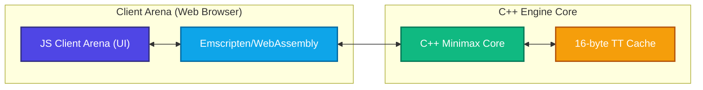

# Togyzkumalak-Wasm: High-Performance Combinatorial State-Space Simulator

*Read this in other languages: [English](https://github.com/ansarzeinulla/9Q/blob/main/README.md) | [Қазақша](https://github.com/ansarzeinulla/9Q/blob/main/docs/locales/README_kk.md) | [Русский](https://github.com/ansarzeinulla/9Q/blob/main/docs/locales/README_ru.md) | [Кыргызча](https://github.com/ansarzeinulla/9Q/blob/main/docs/locales/README_ky.md)*

[](https://github.com/ansarzeinulla/9Q/actions)
[](https://github.com/ansarzeinulla/9Q/actions/workflows/codeql.yml)
[](https://codecov.io/github/ansarzeinulla/9Q)[](https://ansarzeinulla.github.io/9Q/)
[](https://opensource.org/licenses/MIT)
[-informational)](#citation)
[](https://9qumalaq.vercel.app/)

🎮 **[PLAY LIVE WEB DEMO HERE](https://9qumalaq.vercel.app/)** | 📖 **[API DOCUMENTATION](https://ansarzeinulla.github.io/9Q/)**

**A C++17 engine and simulator for Togyzkumalak: an upper bound of $1.51 \times 10^{25}$ on the state space, an exhaustive search showing that no game ends before half-move 11, a one-billion-game random-playout study, and an alpha-beta engine with compact 16-byte transposition-table entries.**

## 🔬 Architecture



- **Transposition table:** fixed-size table of packed 16-byte entries (`static_assert(sizeof(TTEntry) == 16)`), 64-bit Zobrist lock, depth-preferred replacement. Search is single-threaded.
- **Search:** alpha-beta minimax with iterative deepening, TT-guided move ordering and quiescence search (DAGv1, the engine in the paper), plus DAGv2 with killers, history, aspiration windows and PVS.
- **Exhaustive early-game search:** all 1,559,006,339 legal moves from the 185,464,053 distinct positions at half-move 10 are non-terminal, and an 11-half-move terminal game exists, so the shortest possible game has 11 half-moves. Table 2 of the paper is independently reproduced through ply 8 (see below).
- **Billion-game simulator:** multi-threaded random playouts; aggregate counters of the full $10^9$-game run are in `research/sample_billion_game_statistics.txt`.

## 🚀 Live WebAssembly Demo
The C++ engine is cross-compiled to WebAssembly with Emscripten and runs entirely in the browser, at about 70% of native speed in our benchmark.

**[Play against the Engine in your Browser](https://9qumalaq.vercel.app/)**

## ⚡ Performance Benchmarks
*Initial position, single thread, fresh 256 MB TT, iterative deepening. Apple M2 Pro. Node counts are deterministic; times are medians of 3 runs and vary with machine and thermal state. Reproduce with `./build/tg_bench_search`.*

| Engine | Target | Depth finished in 1.0 s | Nodes/s (to depth 9) | Nodes to finish depth 9 |
| :--- | :--- | :---: | ---: | ---: |
| DAGv1 (paper engine) | Native, Apple clang 16 `-O3` | 8 | 3.51M | 7,936,122 |
| DAGv1 (paper engine) | Wasm, Emscripten 6.0 / Node 26 (V8) | 7 | 2.42M | 7,936,113 |
| DAGv2 | Native, Apple clang 16 `-O3` | 9 (0.26 s) | 3.54M | 934,389 |
| DAGv2 | Wasm, Emscripten 6.0 / Node 26 (V8) | 9 (0.34 s) | 2.77M | 934,389 |

TT-guided move ordering cuts the nodes needed to finish depth 9 from 19,267,114 to 7,936,122 (2.43×) in DAGv1.

## 🛠️ Build Instructions (CMake)

**Prerequisites:** `cmake >= 3.20`, a C++17 compiler (`clang++` recommended), and `make` or `ninja`.

```bash
# 1. Clone the repository and navigate into it
git clone https://github.com/ansarzeinulla/9Q.git && cd 9Q

# 2. Generate build system files
cmake -B build -DCMAKE_BUILD_TYPE=Release

# 3. Compile the core engine and tools
cmake --build build -j

# 4. Run the tests and the Perft check (depths 1-4: 9, 73, 613, 5199)
ctest --test-dir build
./build/perft_test
```

To build the WebAssembly engine used by the web demo:

```bash
npm run setup:emscripten   # once: installs emsdk into .emsdk/
npm run build:wasm         # writes web/public/wasm/togyz_engine.{js,wasm}
npm run dev                # serves the demo at http://127.0.0.1:3000
```

## 📊 Reproducing the Paper

The paper's results were produced with the code at tag [`icga-2026-submission`](https://github.com/ansarzeinulla/9Q/tree/icga-2026-submission); the tools below reproduce them on the current code.

| Paper result | Command | Expected output |
| :--- | :--- | :--- |
| Table 2 (exhaustive search), Perft | `./build/perft_test` | 9, 73, 613, 5199 |
| Table 2, independent check | `python3 tools/independent_crosscheck/crosscheck_table2.py --togyz-py <togyz_py>` | plies 1–8 match (see [README](tools/independent_crosscheck/README.md)) |
| Table 1 (shortest game) | `./build/tg_shortest_solver --no-proof` (drop `--no-proof` to also run the exhaustive proof; memory-heavy, it keeps every position up to ply 9) | 11 half-moves, final Kazans 88-10 |
| Table 6 (playing strength) | `./build/tg_tournament --paper` | see below |
| Table 8, Sec. 9.2 (speed, move ordering) | `./build/tg_bench_search` | see Performance Benchmarks |
| Figures 1–3, billion-game statistics | `cd research && pip install -r requirements.txt && python reproduce_figures.py` | `research/output/Figure_{1,2,3}_*.png` |

`research/sample_billion_game_statistics.txt` holds the aggregate counters of the full $10^9$-game run (per-ply positions, legal moves, Kazan sums, outcomes, openings, Tuzdyk statistics). Per-game records are not stored.

Fixed-depth tournament, 500 start positions (6 random opening plies) × 2 colour orders, threefold repetition = draw, seed 2026:

| Player A | Player B | A wins | B wins | Draws |
| :--- | :--- | ---: | ---: | ---: |
| Minimax (D=1) | Random | 100.0% | 0.0% | 0.0% |
| Minimax (D=3) | Random | 100.0% | 0.0% | 0.0% |
| Minimax (D=3) | Minimax (D=1) | 71.3% | 25.8% | 2.9% |
| Minimax (D=5) | Minimax (D=3) | 59.5% | 37.8% | 2.7% |

## 📚 Citation

If you use this engine, the complexity bounds, or the billion-game statistics, please cite the paper (under review at the *ICGA Journal*):

```bibtex
@article{zeinulla2026togyzkumalak,
  title   = {Combinatorial State-Space and Empirical Game Tree Complexity of Togyzkumalak: A Billion-Game Analysis},
  author  = {Zeinulla, Ansar},
  journal = {ICGA Journal},
  note    = {Under review},
  year    = {2026}
}
```
