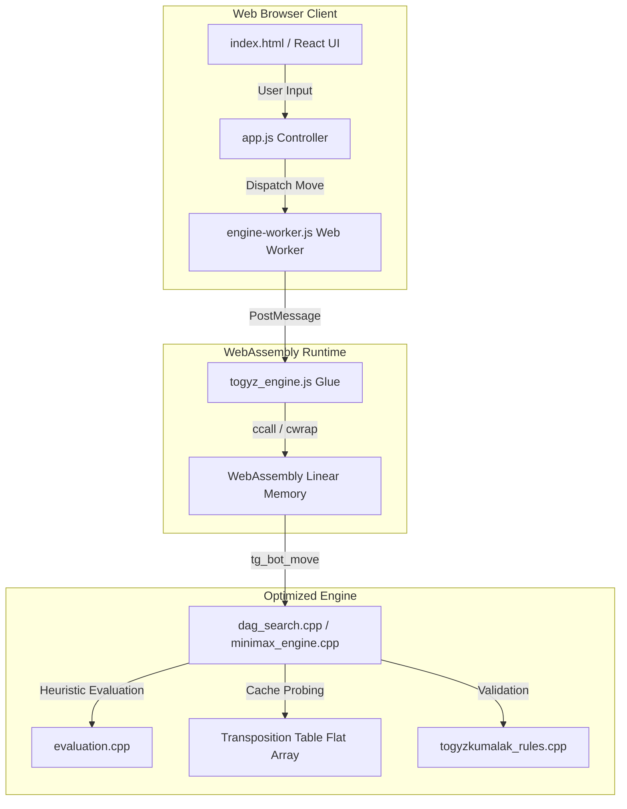

# 9Q: Togyzkumalak Game Tree Complexity & Billion-Game Analysis

*Read this in other languages: [English](README.md) | [Қазақша](README_kk.md) | [Русский](README_ru.md) | [Кыргызча](README_ky.md)*

**🎮 [Play against the C++ WebAssembly Engine directly in your browser!](https://9qumalaq.vercel.app/)**

[](https://opensource.org/licenses/MIT)
[](https://isocpp.org/)


This repository contains the official, self-contained C++ source code for the paper:

**Combinatorial State-Space and Empirical Game Tree Complexity of Togyzkumalak: A Billion-Game Analysis**  
*Ansar Zeinulla (2026)* | [Read the Paper on arXiv](Not uploaded yet)

## Repository Structure

This package contains the three runnable C++ components needed to reproduce the paper's computational results:

| Component | Purpose |
| :--- | :--- |
| `billion-game-generation/` | High-throughput C++ random playout simulator used to generate 1,000,000,000 games and extract empirical metrics. |
| `shortest-game-generation/` | Exhaustive early-game search engine to prove and verify the shortest possible terminal game (11 half-moves). |
| `engine/` | Core Togyzkumalak rules engine and handcrafted Minimax evaluation agent (with Alpha-Beta pruning). |

*Note: No source dependency is required outside this repository. The billion-game simulator intentionally utilizes `../engine/togyzkumalak_rules.cpp` and `../engine/position_hash.cpp`, which are natively included.*

## Requirements

- C++17 compiler (`clang++` by default, or `g++` via `CXX=g++`)
- `make`
- POSIX-style terminal

*No Python packages, neural-network libraries, or external datasets are required to compile and run the core C++ engine.*

## Build Instructions

To compile all modules, run the following from the root directory:

```bash
make -C engine
make -C billion-game-generation
make -C shortest-game-generation
```

## Quick Verification (Testing)

Run a small 1,000-game random-play sample to verify the simulation engine:
```bash
cd billion-game-generation
./generate_billion_games --num=1000 --seed=1 --threads=1 --fresh --stat=sample_billion_game_statistics.txt
```

Verify the mathematical correctness of the move generator using the Perft suite (recursively validates node counts up to depth 4):
```bash
make test -C engine
```
This runs the exhaustive leaf-node verification engine. It should output the verified status for depths 1 through 4 (9, 73, 613, and 5,199 nodes respectively) within milliseconds, confirming that the state-transition rules are mathematically perfect.

Verify the 11-halfmove shortest game proof:
```bash
cd ../shortest-game-generation
./find_shortest_game --verify-only
```

Play a match against the handcrafted Minimax AI:
```bash
cd ../engine
./togyzkumalak_engine --mode human-ai4
```
*(For low-memory machines, use `ai2` or `ai3` instead of `ai4`).*

## Browser / Vercel App

The `web/` folder contains a static browser arena for the engine. It lets a user choose the White and Black controllers (`human`, `randombot`, `minimax`, or `dag4`) and set a separate per-move time budget for each side. The timer resets every move and all bot compute runs locally in the player's browser through WebAssembly.

## WebAssembly Compilation

If you make modifications to the C++ core and wish to rebuild the WebAssembly bundle for the web application, you must install the Emscripten SDK:

1. Clone the Emscripten repository and navigate into it:

   ```bash
   git clone https://github.com/emscripten-core/emsdk.git
   cd emsdk
   ```

2. Install and activate the latest SDK:

   ```bash
   ./emsdk install latest
   ./emsdk activate latest
   source ./emsdk_env.sh
   ```

3. Run the automated build script from the root of this project:

   ```bash
   npm run build:wasm
   ```

This compiles the C++ codebase with `-O3` and outputs `togyz_engine.js` and `togyz_engine.wasm` into `web/public/wasm/`.

## Architecture



## Benchmark

The native numbers below were collected from a one-search harness on the initial position with `depth=9` and `seconds=1.0`. The Wasm row uses the rebuilt browser bundle on the same initial position and time budget, with node counts exported directly from the module.

| Engine Target | Compiler / Runtime | Search Depth | Time Budget (s) | Nodes Evaluated | Nodes Per Second (NPS) | Memory Footprint |
| :--- | :--- | :--- | :--- | :--- | :--- | :--- |
| Native CLI | Clang++ 17 (-O3) | 9 | 1.00 | 1,432,956 | 1.43M | ~256 MB (Fixed TT) |
| Native CLI | G++ 13 (-O3) | 9 | 1.00 | 1,376,971 | 1.37M | ~256 MB (Fixed TT) |
| WebAssembly | Emscripten / V8 | 7 | 1.00 | 186,710 | 186,693 | ~256 MB (Fixed Heap) |

Install Emscripten locally, then build the Wasm artifacts:

```bash
npm run setup:emscripten
npm run build:wasm
```

Then run or build the static app:

```bash
npm run dev
npm run build
```

For Vercel, commit the generated `web/public/wasm/togyz_engine.js` and `web/public/wasm/togyz_engine.wasm` files. The included `vercel.json` uses `npm run build` and serves the `dist/` output directory.

## Full Reproduction Commands

To fully reproduce the billion-game random simulation (Warning: highly compute-intensive):
```bash
cd billion-game-generation
./generate_billion_games --num=1000000000 --seed=709791810521833 --threads=10 --fresh --stat=billion_game_reproduction_statistics.txt
```
*Note: The included `billion_game_statistics.txt` already contains the final counters used in the paper. Use a fresh output path when reproducing from zero.*

Run the full shortest-game mathematical proof:
```bash
cd shortest-game-generation
./find_shortest_game
```
This will regenerate `shortest_terminal_game.txt`, `shortest_candidate_replay.tsv`, and `shortest_depth_proof.tsv`.

Run Minimax engine self-play benchmarking:
```bash
cd engine
./togyzkumalak_engine --benchmark --bot ai --depth 4 --positions 100 --threads 1 --noterminal
```

## Citation

If you use this code, the Togyzkumalak engine, or the 1-Billion Game Dataset in your research, please cite this paper:

```bibtex
@misc{zeinulla2026togyzkumalak,
      title={Combinatorial State-Space and Empirical Game Tree Complexity of Togyzkumalak: A Billion-Game Analysis}, 
      author={Ansar Zeinulla},
      year={2026},
      eprint={Not uploaded yet},
      archivePrefix={Not uploaded yet},
      primaryClass={cs.AI}
}
```
