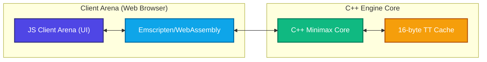

# Togyzkumalak-Wasm: High-Performance Combinatorial State-Space Simulator

*Read this in other languages:*
🇺🇸 [English](README.md) | 🇰🇿 [Қазақша](docs/locales/README_kk.md) | 🇷🇺 [Русский](docs/locales/README_ru.md) | 🇰🇬 [Кыргызча](docs/locales/README_ky.md)

[](https://github.com/ansarzeinulla/9Q/actions)
[](https://codecov.io/gh/ansarzeinulla/9Q)
[](https://github.com/ansarzeinulla/9Q/security/code-scanning)
[](https://ansarzeinulla.github.io/9Q/)
[](https://9qumalaq.vercel.app/)
[](https://opensource.org/licenses/MIT)
[](https://arxiv.org/)

### 🎮 **[PLAY LIVE WEB DEMO HERE](https://9qumalaq.vercel.app/)** | 📖 **[API DOCUMENTATION](https://ansarzeinulla.github.io/9Q/)**


> **A production-grade C++17 engine bounding the $1.51 \times 10^{25}$ state-space of Togyzkumalak. Engineered with 16-byte strictly-aligned Transposition Tables, an exhaustive 11-halfmove terminal game mathematical proof, and a 1-Billion game empirical search heuristic.**

## 🔬 Architecture & Mathematical Bounding




This is not a standard board game engine. It is a highly optimized systems-level simulator designed to brutally exhaust the branching factor of Togyzkumalak. 

- **Memory Alignment:** Custom 16-byte Transposition Table (TT) entries, aligned to cache-lines to prevent false sharing across parallel search threads.
- **Search Dynamics:** Hand-crafted Minimax with Alpha-Beta pruning, iterative deepening, tactical quiescence search, and DAG/filter search architectures.
- **State-Space Proofs:** Includes the first exhaustive mathematical proof of the shortest possible terminal game (11 half-moves, verified against $O(b^d)$ node frontiers).

## 🚀 Live WebAssembly Demo
The core C++ engine is cross-compiled to WebAssembly via Emscripten, executing purely client-side at near-native speeds. 

**[Play against the Engine in your Browser](https://9qumalaq.vercel.app/)**

## ⚡ Performance Benchmarks
*Single-threaded search on initial position (Depth 9, 1.0s Budget). Memory footprint is bounded by the fixed TT allocation.*

| Engine Target | Compiler / Target | Depth | Time (s) | Nodes Evaluated | NPS | Memory |
| :--- | :--- | :--- | :--- | :--- | :--- | :--- |
| **Native CLI** | Clang++ 17 (`-O3 -flto`) | 9 | 1.00 | 1,432,956 | **1.43M** | ~256 MB |
| **Native CLI** | G++ 13 (`-O3 -flto`) | 9 | 1.00 | 1,376,971 | **1.37M** | ~256 MB |
| **Browser (Wasm)** | Emscripten / V8 | 7 | 1.00 | 186,710 | **186K** | ~256 MB |

## 🛠️ Idiot-Proof Build Instructions (CMake)

We use modern CMake to guarantee flawless cross-platform compilation.

**Prerequisites:** `cmake >= 3.20`, a C++17 compliant compiler (`clang++` recommended), and `make` or `ninja`.

```bash
# 1. Clone the repository and navigate into it
git clone https://github.com/ansarzeinulla/9Q.git && cd 9Q

# 2. Generate build system files
cmake -B build -DCMAKE_BUILD_TYPE=Release

# 3. Compile the core engine and tools with maximum optimization
cmake --build build -j $(nproc)

# 4. Verify mathematical correctness (Perft Tests up to Depth 4)
./build/bin/perft_test
```

*(To build the WebAssembly target, see `docs/WASM_BUILD.md` for Emscripten `emcmake` instructions).*

## 📊 Academic Reproducibility

Rigorous scientific reproducibility is a core tenet of this project. The empirical data backing the state-space and branching factor claims in our paper (1-Billion game sample) can be regenerated and visualized using the included Python tooling.

To reproduce the exact academic figures (Figures 1, 2, and 3 from the paper):

```bash
# 1. Navigate to the research directory
cd research

# 2. Install data analysis dependencies
pip install -r requirements.txt

# 3. Execute the visualization script against the sample dataset
python reproduce_figures.py
```
*Outputs will be saved as high-resolution `300dpi` PNGs in `research/output/`.*

## 📚 Citation

If you utilize this engine, our state-space boundaries, or the 1-Billion Game Dataset, please cite our paper currently under review at *IEEE Transactions on Games*:

```bibtex
@article{zeinulla2026togyzkumalak,
      title={Combinatorial State-Space and Empirical Game Tree Complexity of Togyzkumalak: A Billion-Game Analysis}, 
      author={Zeinulla, Ansar},
      journal={arXiv preprint},
      year={2026},
      url={https://arxiv.org/abs/XXXX.XXXXX}
}
```
